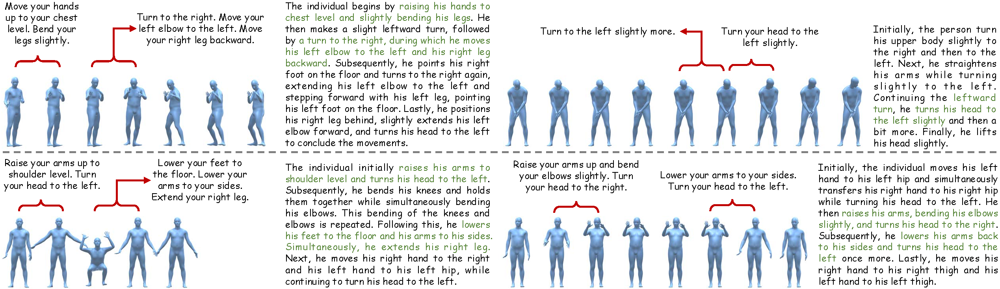

# <b>FineMotion: A Dataset and Benchmark with both Spatial and Temporal Annotation for Fine-grained Motion Generation and Editing</b>

FineMotion provides strictly aligned, fine-grained descriptions of human body part movements (BPM) for both motion snippets (short segments of motion sequences) and entire motion sequences, with motions sourced from [HumanML3D](https://github.com/EricGuo5513/HumanML3D/)).

<div  align="center">    
  
</div>

<br>


<details> 
  
  **<summary>Statistics of FineMotion</summary>**
  
### :bar_chart: Statistics

In summary, our FineMotion dataset contains **21,346** human-annotated BPM descriptions and **420,968** automatically generated ones for diverse motion snippets, i.e., BPMSD. Notably, the temporal information within the textual annotations facilitates easy augmentation, such as performing random cropping along the temporal dimension. This approach can generate numerous pairs of motion clips—each consisting of several adjacent snippets—along with their corresponding BPM descriptions. 

Additionally, the dataset includes **4,492** BPM paragraphs (BPMP) organized from human-annotated BPM snippet descriptions, and **89,940** paragraphs organized from automatically generated BPM snippet descriptions, covering a total of 29,232 motion sequences. 

For BPMSD, the average and median lengths are **18** and **19** words, respectively. As for BPMP, the average and median lengths are **244** and **220** words, respectively.


### :woman_judge: Data Quality

TODO

</details>

If this dataset is useful in your projects, we will apprecite your star on this codebase. 😆😆


## How to Obtain the Data
For motion sequences, you could find the details as well as download link [here](https://github.com/EricGuo5513/HumanML3D/)).

For our fine-grained textual descriptions, you could directly download them from this repository under the folder "./FineMotion".


## Data Structure

```sh
<FineMotion>
./BPMP_auto.zip        // Automatically-Generated Body Part Movement Paragraph.
./BPMSD_auto.zip       // Automatically-Generated Body Part Snippet Descriptions.
./BPMP_human.zip       // Human-Annotated Body Part Movement Paragraph. Coming Soon!
./BPMSD_human.zip      // Human-Annotated Body Part Snippet Description. Coming Soon!
```

Unzip all files under the folder "./FineMotion" to obtain four JSON files: 'BPMP_auto.json', 'BPMSD_auto.json', 'BPMP_human.json', and 'BPMSD_human.json'. 
All JSON files use a dictionary format. The keys follow the same naming protocols as HumanML3D for consistency, while the values contain fine-grained textual descriptions of the corresponding motion sequences in HumanML3D. Specifically, the description in the value of the key "XXXXXX" (e.g., '000000') precisely describes the human motion stored in "./new_joints (or new_joint_vecs)/XXXXXX.npy" (e.g., '000000.npy') in HumanML3D.

An example of all the detailed human body part snippet descriptions (BPMSDs) in a whole human motion sequence is shown below:
```sh
{
    "000314": # name of motion sequence
    [
        "",            # 0.0s-0.5s’ BPMSD
        "Raise your hands up to your head. Turn your head to the left.”,
        "",            # 1.0s-1.5s’ BPMSD
        "",            # 1.5s-2.0s’ BPMSD
        "Lean to the right. Move your hands closer together. Turn your head to the left.",
        "",            # 2.5s-3.0s’ BPMSD
        "Lower your arms to your sides. Turn your head to the left.",
        "Lean your upper body to the right. Move your right hand to your right thigh. Move your left hand to your left thigh."
    ],
}
```
Each item in the list (i.e. the value of the key "000314") represents a fine-grained human body movement snippet description for a 0.5s interval.

An example for three different detailed human body part paragraphs (BPMPs) for the same human motion sequence is shown below:
```sh
{
    "000314": # name of motion sequence
    [
        "Beginning with his hands raised overhead and his head turned left, the individual leans to the right while bringing his hands closer and maintaining his head position. Continuing the movement, he lowers his arms to his sides while keeping his head turned left. Subsequently, he leans his upper body to the right and simultaneously moves his right hand to his right thigh and his left hand to his left thigh.", 
        "Initially, the individual raises both hands above his head and turns his head to the left. He then leans to the right while bringing his hands closer together. Simultaneously, he maintains his head turned to the left. Subsequently, he lowers his arms to his sides and continues turning his head to the left. Finally, he leans his upper body to the right, placing his right hand on his right thigh and his left hand on his left thigh.",
        ”Initially, the individual raises his hands to his head and turns his head to the left. Subsequently, he leans to the right while continuing to move his hands closer together and turning his head to the left. Next, he lowers his arms to his sides and keeps turning his head to the left. Finally, he leans his upper body to the right, placing his right hand on his right thigh and his left hand on his left thigh."
    ],
}
```
Each item in the list (i.e. the value of key "000314") represents a fine-grained human body movement paragraph for the entire motion sequence.


## Citation

If you are using FineMotion dataset, please consider citing this repository:
```
@misc{Wu_FineMotion_Dataset,
    author = {Wu, Bizhu and Xie, Jinheng and Ding, Meidan and Kong, Zhe and Ren, Jianfeng and Bai, Ruibin and Qu, Rong and Shen, Linlin},
    title = {{FineMotion Dataset}},
    url = {https://github.com/BizhuWu/FineMotion}
}
```


## Acknowledgments
Thanks to [HumanML3D](https://github.com/EricGuo5513/HumanML3D/), our repository is partially borrowing from them.
